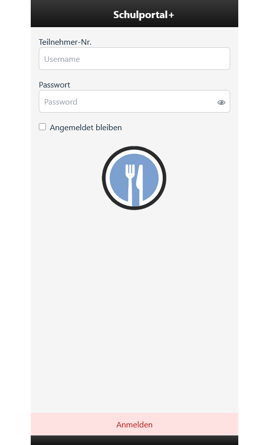
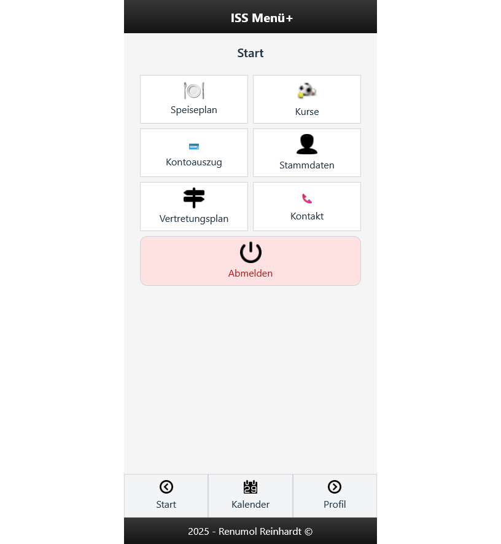
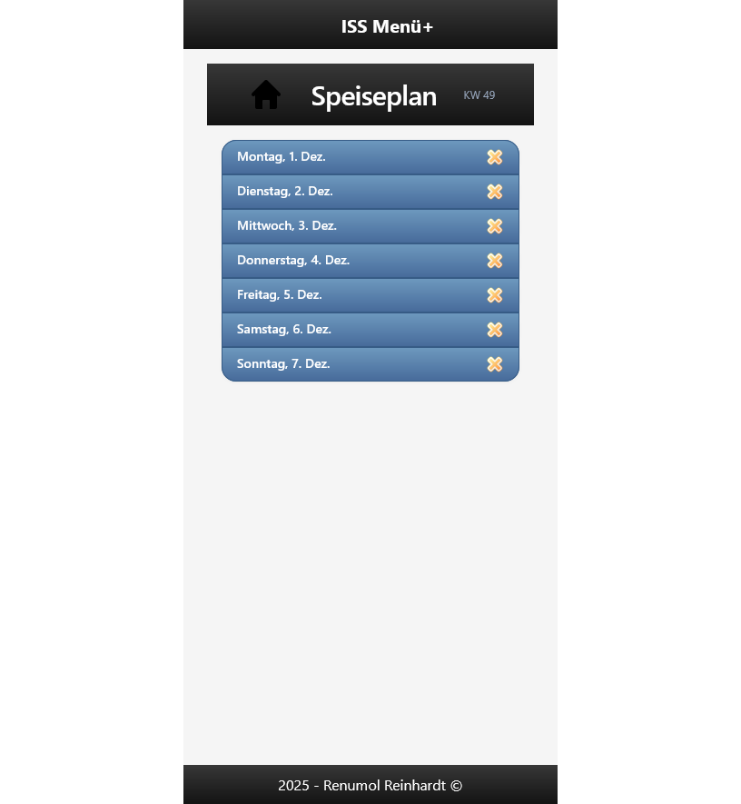

# ISS Menü Plan – Monorepo

Dieses Repository enthält:

- **frontend/** – Mobile App (Vue 3, Vite, Capacitor)
- **backend/** – Laravel API

## Installation

### Backend installieren
cd backend
composer install
cp .env.example .env
php artisan key:generate
php artisan migrate --seed
php artisan serve

### Frontend installieren
cd frontend
npm install
npm run dev

## Build der App (Android/iOS)
cd frontend
npx cap sync
npx cap open android   # oder ios

# ISS Menü Plan – Screenshot

